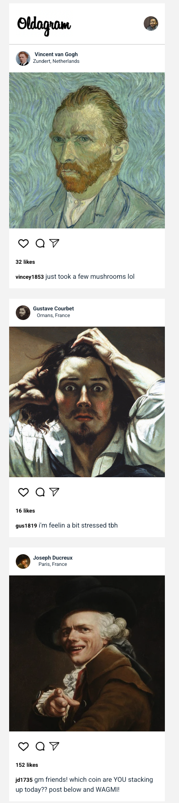

# Oldagram


A nostalgic Instagram-inspired application showcasing posts from famous classical artists. Experience social media as it might have existed in the days of Van Gogh, Courbet, and Ducreux.

## Table of Contents

- [Features](#features)
- [Screenshots](#screenshots)
- [Installation](#installation)
- [Usage](#usage)
- [Technologies Used](#technologies-used)
- [Project Structure](#project-structure)
- [Contributing](#contributing)
- [License](#license)

## Features

- **Responsive Design**: Mobile-first approach that works across devices
- **Artist Profiles**: View profiles of famous classical artists
- **Interactive Elements**: Like posts and see like counts update in real-time
- **Classical Artwork**: Browse through timeless masterpieces in a familiar social media format
- **Clean UI**: Simple, intuitive interface inspired by popular social media platforms

## Screenshots



## 🎬 Demo

[View Live Demo](https://oldagram.kevinngongang.dev)
## Installation

1. Clone the repository:
   ```bash
   git clone https://github.com/bakadja/oldagram.git
   cd oldagram
   ```

2. Install dependencies:
   ```bash
   npm install
   ```

## Usage

### Development

Run the development server:

```bash
npm run dev
```

This will start the Vite development server at `http://localhost:5173`.

### Building for Production

Build the project:

```bash
npm run build
```

Preview the production build:

```bash
npm run preview
```

## Technologies Used

- **TypeScript** - Strongly typed programming language that builds on JavaScript
- **Vite** - Next generation frontend tooling
- **CSS3** - For styling and responsive design
- **Modern JavaScript** - ES6+ features

## Project Structure

```
oldagram/
├── src/
│   ├── assets/       # Images and icons
│   ├── counter.ts    # Like counter functionality
│   ├── main.ts       # Main application entry point
│   ├── posts.ts      # Post data and interfaces
│   └── style.css     # Global styles
├── index.html        # Main HTML file
├── tsconfig.json     # TypeScript configuration
└── package.json      # Project dependencies and scripts
```

## Contributing

Contributions are welcome! Please feel free to submit a Pull Request.

1. Fork the repository
2. Create your feature branch (`git checkout -b feature/amazing-feature`)
3. Commit your changes (`git commit -m 'Add some amazing feature'`)
4. Push to the branch (`git push origin feature/amazing-feature`)
5. Open a Pull Request

## License

This project is licensed under the MIT License - see the [LICENSE](LICENSE) file for details.


